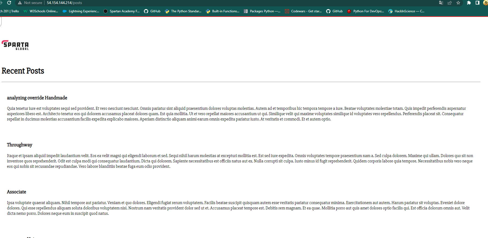

# Cloud-computing-AWS

1. Log in 
2. Change region to Ireland eu-west-1


## Cloud computing

Cloud computing means storing and accessing data and programs over the internet instead of your computer's hard drive.

Users access cloud services either through a browser or through an app, connecting to the cloud over the internet.

### SaaS (Software as a service)

Insted of users installing an application on their device, **SaaS** applications are hosted on cloud servers, and users can access them over the internet.

Saas applications:

- Salesforce
- MailChimp
- Slack

### PaaS (Platform as a service)

In this model, companies don't pay for hosted applications, instead they pay for things they need to build their own applications.

PaaS vendors offer everything necessary for building an application, including development tools, infrastructure and operating systems over the Internet.

- Heroku
- Microsoft Azure


### IaaS (Infrastructure as a service)

In this model, a company rents the servers and storage they need from a cloud provider. They then use the cloud infrastructure to build their applications.

IaaS providers:
- Digital Ocean
- Google Compute Engine
- OpenStack


Formerly, SaaS, PaaS and IaaS were the three main models of cloud computing, and essentially all cloud services fit into one of these categories. However, in recent years a fourth model has emerged:

### FaaS (Function as a service)

Also known as serverless computing, breaks cloud applications down into even smalled componenets that only run when they are needed.

FaaS or serverless applications still run on servers, as do all these models of cloud computing. But they are called "serverless" because they do not run on dedicated machines, and because the companies building the applications do not have to manage any servers.


## Types of Cloud 

---

1. **Private cloud**: A private cloud is server, data center, or distributed network wholly dedicated to one organization
Also known as an internal cloud or corporate cloud, is a cloud computing environment in which all hardware and software recources are dedicated exclusively to, and accessible only by, a single customer

---

2. **Public cloud**: A public cloud is defined as computing services offered by third-party provides over the public internet, making them available to anyone who wants to use or purchase them. 
They may be free or sold on-demand, allowing customers to pay only per usage for the CPU cycles, storage, or bandwidth they consume.

---

3. **Hybrid cloud**: A hybrid cloud could combine a public cloud and a private cloud running on-premises or on the edge. It could also combine a public cloud with another public cloud.
Hybrid models are meant to allow an organization to mix and match environments and to choose what works best for the specific applications and data.


# How to set up tier2 architecture


First we need to create .ssh folder 

`mkdir .ssh`

After we need to navigate into that folder `cd .ssh` (this is the folder where we need to copy the keys)

A key needs to be generated. 

**AWS website**

Log in and make sure your region is Ireland.

In a search bar we search for EC2 server. In this case one key would be generated for us.

**GitBash**
We have to download the key `.pem` and we move the content to the `.ssh` folder.

`nano devops-tech201.pem` to enter the file and we copy paste the content of the key file - `ctrl+x`

To double check `cat devops-tech201.pem` shows the content we pasted.


**AWS**

Go to EC2 dashboard.

Next we want to launch the VM on the cloud. We will have to set the configuration we want for our VM.

Click on "Launch instance" to launch instance fresh.

For the name we will have to specify our name,group and VM's name

We have to search for operating system, in our case "ubuntu 18.04".

"Instance type (t2.micro)" specifies how many cpu's, how much memory and the cost per hour.

After that we will need to select the key.

In network settings we need to create security group and we need to choose `SSH traffic` and on the drop down button we need to choose our own IP address and allow `HTTP traffic` because nginx is using port 80. (HTTPS is needed in the production environment).

Next we come we dont want to create another security group so in the network settings we click on "Edit"

- Subnet setting- Default 1a to make sure its public subnet

- Auto-assing public IP - Enable

- Security group name- your_name-tech201-app

- Same for the description + required ports 3000-80-

1. type- ssh
source type - My IP

2. type- HTTP
source type - Anywhere

To add another rule because we need to add the port 3000

3. port range - 3000
Source type - Anywhere
Type- Custom TCP
Description - For node app


Down in the summary- Number of instances to launch, in our case its 1

Lastly, we click on Launch and once launched we click on the ID provided and it takes us to Dashboard

Now we have to check the functionality.

After selecting our instance we click on the "Connect" button on top

From there we click on SSH client


**GitBash**

In the .ssh folder we run `chmod 400 devops-tech201.pem` (which is the name of the folder with the key) and we tn permissions to read only.

To check the premissions we run `ll`

Go back to AWS and copy the example code(confirming that I am the person that you provided the key to) 

copy that into GitBash to `ssh` into the EC2 instance.

After that we need to update and install the nginx

`sudo apt-get update -y`
`sudo apt-get install nginx -y`

After these steps are done we import the IP address into our browser to check the functionality of nginx()

**GitBash**

If everything is up to date so far we come back to our GitBash and exit our machine `exit`.

**Note**- to connect to any instance we will need to copy the code from example section in AWS and paste in the GitBash local host. 

### ***If we would like to migrate file onto our EC2 instance:***

- First we have to navigate into our secure shell folder we created previously `cd .ssh`

- The way we can copy certain file over to global is using `scp` (Secure Copy Protocol). 

```
scp -i devops-tech201.pem -r /c/Users/matya/Documents/'Tech201- Virualization'/Virtualization/tech201_virtualization/app ubuntu@ec2-3-248-196-21.eu-west-1.compute.amazonaws.com:/home/ubuntu

```
"devops-tech201.pem" is the file that is containing the content of a generated key.

Then we follow with the path of the folder we want to migrate. 

 The last part specifies the code that we use to ssh into our global machine.

 **Note**: The GitBash will not like backslash so use forward slash. 

 After we will have to connect to our global machine
 using the command provided on AWS

 ```
ssh -i "devops-tech201.pem" ubuntu@ec2-3-248-196-21.eu-west-1.compute.amazonaws.com
```

- Then we need to make sure we navigate into the app folder `cd app` and use `ls` to check if we have the provision file in there and run `sudo apt install npm`
- We also need to run the app using `node app.js`

We can check that the app is working on the browser with the port. 


### To implement the reverse proxy we will have to change the default configuration of nginx file 

```
sudo nano /etc/nginx/sites-available/default
```

The configuration that we need in this case with port 3000 is as follows:

```
server {
        listen 80 default_server;
        listen [::]:80 default_server;

        root /var/www/html;


        index index.html index.htm index.nginx-debian.html;

        server_name _;

        location / {
                proxy_pass http://localhost:3000;
        }

}

```

After that we will need to run a few commands:

`sudo nginx -t`
`sudo systemctl restart nginx`

And lastly we run our app : `node app.js`


--- 

## Creating a 2tier architecture


In this architecture we can see that the environments are independent and in case we encounter a problem there will be no downtime of the services. If problem occurs the user should never be affected and should be redirected to a page that contains information such as: **Apologies for the incovenience, the site will be up again shortly** 

The reason why it is beneficial to refactor the monolith architecture to 2tier architercture is that the monolith architecture makes development slower and it is not **scalable**.

**Reliability** - If there is an error in any module, it could affect the entire applicationt's availability. 

**2-tier architecture** mitigates all of these issues. 

---

The availability zones or **AZ's** refer to the distinct locations within an AWS region that are engineered to be isolated from failures in other AZ's.

To achieve low latency we have to make sure that the AZ's that we choose for the use is the closest one possible. 

### **Note** 
Each region is completely independent.  


**Security rules of app**
- Subnet setting- Default 1a to make sure its public subnet

- Auto-assing public IP - Enable

- Security group name- your_name-tech201-app

- Same for the description + required ports 3000-80-

1. type- ssh
source type - My IP

2. type- HTTP
source type - Anywhere

To add another rule because we need to add the port 3000

3. port range - 3000
Source type - Anywhere
Type- Custom TCP


Security rules for DB

- We need to allow 27017 port from anywhere
- Only allow it from app instance 

Mongodb.conf rules
- Change confguration of mongod.conf to 0.0.0.0


Env var set up 


## Creating 2nd 2tier instance (database)


First we need to create an instance on AWS website with the appropriate name in our case ending with "db" for database. 

Security settings:

- Default vpc
- Subnet: Default 1a
- Auto-assing public IP: Enable

Firewall:

Security rule 1.: 
- Type: SSH, Protocol: TCP, Port range: 22
- Source type: My IP

Security rule 2.:
- Type: Custom TCP, Port range: 27017
- Source type: Anywhere

After we create an instance we go to our GitBash terminal and make sure we are in the .ssh folder. 

We `ssh` into out db machine using the code in the example section after connect to the instance on AWS. 

- First we need to run `sudo apt-get update -y` to get the necessary updates and to establish the connection to the internet.

- We will have to migrate the db provision.sh script

- There are multiple ways to do that, in this case we used our repository from GitHub where the provision.sh script for db is located using `git clone + URL from the repository`

- When we have this imported, we have to navigate to the correct folder where the provision.sh file is with the script. (`ls`, `cd`)

- When we are in the correct folder we have to make sure that the script is correct `sudo nano provision.sh` and comment out the configuration for mongod for it not to be automatically configured.

`sudo ./provision.sh` to run the file.

We change permissions of the file `chmod 700 provision.sh`
This way, the other users will see the etc directory, but will not be able to change into it


` sudo systemctl restart mongod`
`sudo systemctl enable mongod`

We check the status `sudo systemctl status mongod`


We will have to change the configuration of the `mongod.conf` but first we need to use `cd /etc` following with `sudo nano mongod.conf` and change the bindIP to `0.0.0.0` for it to be public and make sure the port is correct too. Using 0.0.0.0 as IP is not a good practice for production environment as it is not secure. 

To check the changes `cat mongod.conf` and check the status `sudo systemctl status mongod`

If the mongod status is active we will have to ssh into our app instance.

Navigate to the correct folder where `app` is located with the correct files. 

Next we will have to create an environment variable with the db IP for connection.

`export DB_HOST=mongodb://db_instance_IP/posts`

To check if it has been created `printenv +name_of_the_variable`

Then we use command `npm install` and `npm start`

`npm install` is used used for installing the dependencies in the project.`

`npm start` is used to execute the command specified scripts.

If the data base hasn't been seeded you will have to run `node seeds/seed.sj` to populate the database with the posts. 

Lastly, we run `npm start` again and our app should be ready and listening on the port specified.

If the reverse proxy is set up we will not need the port number, otherwise we will need to specify the port. 



---

# AMI


AMI stands for ***Amazon Machine Imagine*** and this allows us to save the state and settings of an instance and if we wish to restart this instance, it brings it back in the same state.

Essentially lets us come back to the image of an instance we saved previously. 

You must specify an AMI when you launch an instance. You can launch multiple instances from a single AMI when you require multiple instance with the same configuration.

Using **AMI** helps us to save on the overal costs. Even though the instance could be in passive state, there is certain cost that runs behind the scenes and **AMI** helps us to mitigate these costs.

### Note

The important thing is to ensure that the name and the description is as specific as possible to be able to recognize what image serves what purpose. 


