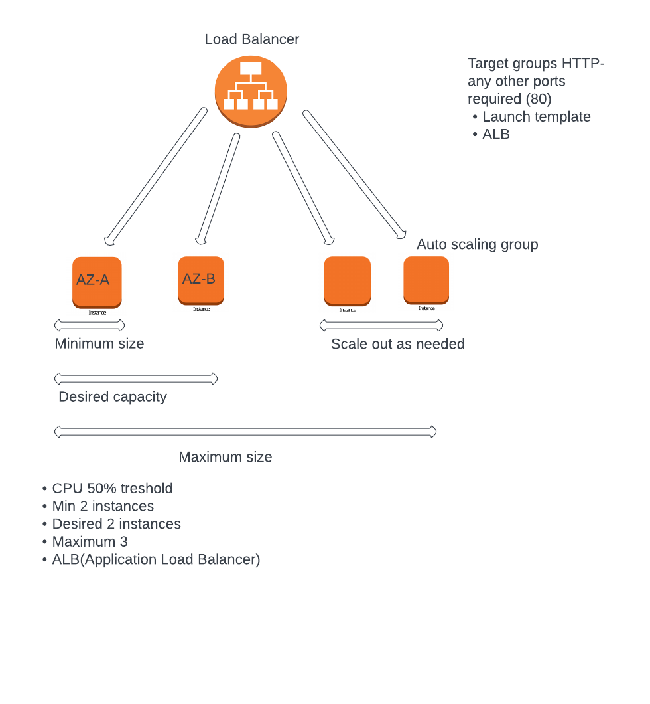

# S3 buckets

An Amazon S3 bucket is a public cloud storage resource available in Amazon Web Services (AWS) Simple Storage Service (S3), an object storage offering.

Amazon S3 buckets, which are similar to file, folders, store objects, constist of data and its descriptive metadata. 

---

### Why to use S3 buckets

It enables fast, easy and secure transfer of a file over the long distance between client and S3 bucket. 

Customers of all sizes and industries can use Amazon S3 to store and protet any amount of data, for a range of use cases, such as data lakes, websites, mobile applications , backup and restore, archive, enterprise applications, IoT devices(Internet of Things) and big data analytics.

---

### Benefits

Low cost: S3 lets you store data in a range of "storage classes". These classes are based on the frequency and immediacy you require in accessing files.

Scalability: S3 provides an easy-to-use secured interface to store and retrieve any amount of data at any given time and device.

Scalability of this service is where multiple users can read or write data with appropriate authentication. 

---

### DR (Disaster recovery)

Amazon S3 offers several disaster recovery options such as data replication, versioning, lifecycle policies, object lock, and backup/restore tools. These features ensure that your data is highly available, durable, and recoverable in case of a disaster. Regular testing of your disaster recovery plan is also recommended.

---

### Use cases


1. Amazon S3 is a highly scalable and durable object storage service that can be used for a wide range of use cases, including:

2. Backup and Recovery: S3 can be used to store backups of critical data and applications, making it easy to recover from disasters and avoid data loss.

3. Data Archiving: S3 is an ideal platform for long-term data archiving due to its low cost and high durability. Data can be stored for years or even decades in S3 without incurring high storage costs.

4. Content Delivery: S3 can be used to store and deliver large multimedia files such as images, videos, and audio files, providing high-performance and low-latency access to content.

5. Big Data Analytics: S3 can be used to store large datasets for big data analytics and machine learning, providing a scalable and cost-effective storage solution.

6. Website Hosting: S3 can be used to host static websites by serving HTML, CSS, and JavaScript files directly from S3, providing a highly available and scalable solution.

7. Disaster Recovery: S3 can be used as a disaster recovery solution, allowing organizations to replicate their data across multiple regions to ensure that it's always available even in the event of a disaster.

8. Application Hosting: S3 can be used to host and deliver application files such as binaries, scripts, and executables, providing a scalable and durable solution for hosting applications.

---

### High availability

Amazon S3 achieves high availability through its distributed architecture and data replication across multiple Availability Zones within a region. Each object stored in S3 is automatically replicated to multiple servers within an Availability Zone, providing redundancy and high availability.

--- 

### Social media


- Social media platforms use Amazon S3 for storing and serving user-generated content such as photos, videos, and posts.

- S3 provides unlimited storage capacity and is highly scalable, allowing social media platforms to store and serve a massive amount of content.

- S3 is integrated with Amazon CloudFront for low-latency content delivery.

- S3 is used for backup and recovery of critical data.

- S3 is used for big data analytics and machine learning to analyze user behavior and preferences.

--- 

### CRUD (Create, Read, Update, and Delete)


Are the 4 basic operations that can be performed on data in most software systems or applications.

These operations represent the basic functionalities that allow users to interact with databse or application.

- Create: This operation allows users to add new data to the system or database.

- Read: This operation allows users to retrieve data from the system or database.

- Update: This operation allows users to modify or update existing data in the system or database.

- Delete: This operation allows users to remove data from the system or database.


CRUD is a fundamental concept in software development and is used in many applications and systems. It provides a simple and intuitive way for users to interact with data, and it forms the basis of many software architectures and frameworks.


# Creating a bucket


---
In this case we will use S3 as a DR(Distaster Recovery) to ensure our files are safe.

---
First things first we need to have a file with access key and secret access key and move that file into our `.ssh` folder and lastly, `ssh` into our newly created instance. 


We need to navigate into S3 section from the EC2 dashboard. 

- In our GitBash terminal after connecting to the instance we need to run `sudo apt update -y` to run updates and check the internet connection following with `sudo apt upgrade -y`.

- We need to install the appropriate version of python `python --version`, for the aws command line. Python 3.6.9 and above is required. 

- `alias python=python3`(in future we have to make this persistent) followed by `sudo apt install python -y` to install the appropriate version, and check the version again `python --version`

- `sudo apt install python3-pip` We need to install the pip package manager

- `sudo pip3 install awscli` to install aws command line using pip3 package manager

- `aws configure` to input the access key and secret key, then which region `eu-west-1` and lastly, output:`json`

- To double check we run `aws configure`, if the configuration has been inputed we only press enter.

- `aws s3 ls` to see what is available in the bucket. 

- `aws s3 mb s3://marek-tech201` (mb stands for make bucket) after // is what we want to name the bucket. This command makes the bucket (folder).

- Then we can check in AWS console/buckets if it has been created. If we would like we can upload object and it creates URL using AWS console. 

- Now that the bucket is created we would like to store data in that bucket. `sudo touch test.txt` for the training purposes. To check if it has been created `ls`

- `sudo nano test.txt` to edit the file 

- We can insert any text to see if it will transfer into our bucket

- `cat test.txt` to see the changes 

- Now we want to upload that file `aws s3 cp test.txt s3://<name of the bucket>`

- We can go back to our AWS console and refresh the page to see if the folder has been uploaded into our bucket

- After that we will need to change permissions in case if the access is denied

- In the AWS console inside our folder we move onto permissions section and grant desired permissions in `edit` section and `save changes`

- Click on the URL if we can see the content we edited in the `test.txt`


## CRUD automation (awscli)

First things first we will need to create a new instance on AWS.

After we connect to that instance using GitBash terminal `ssh` we need to install certain requirements.

- `sudo apt update -y`
- `sudo apt upgrade -y`

We will need python installed 3.6 and above (`pythonn --version`), `alias python=python3` followed by `sudo apt install python -y` to install the appropriate version.

- `sudo apt install python3-pip` We will also need package manager pip

- `pip install boto3` boto3 is SDK(software development kit) for AWS that allows us to directly create, update and delete AWS resources from our Python script.

- We need to ensure we have the correct credentials for AWS S3 which is access key, secret key, region, and format output using `aws configure`

- We will also need to create a file that we want to upload onto our bucket using Python script `test_file.txt` and file that holds our Python script `configuration.py`

- In our configuration.py file we will write our script instructing the file when ran to:
1. Create an S3 bucket using python-boto3

2. Upload a file to S3 bucket

3. Retrieve a file from S3

4. Delete the content from S3

5. Delete the bucket using python-boto3

- To run the configuration.py file we used `python configuration.py` to run the script.

Lastly we can check on AWS/Buckets console if all the automated processes were successful 

---


## Load balancer and auto-scaling




**A Load balancer** serves as the single point of contact for clients. The load balancer distributes incoming application traffic across multiple targets, such as EC2 instances, in multiple Availability Zones. This increases the availability of your application. You add one or more listeners to your load balancer.


**AWS Auto scaling** monitors your applications and automatically adjusts capacity to maintain steady, predictable performance at the lowest possible cost. Using AWS Auto Scaling, it's easy to setup application scaling for multiple resources across multiple services in minutes.


### Policies 

To help optimize scaling performance, you can use multiple target tracking scaling policies together, provided that each of them uses the same metric.

Auto Scaling improves the decision making when determining how much capacity to add to your group. 

The intention of Amazon EC2 Auto Scaling is to always prioritize availability, so its behaviour differs depending on whether the target tracking policies are ready for scale out or scale in. It will scale out the Auto scaling group if any of the target tracking policies are ready to scale out, but will scale in only if all of the target tracking policies are ready to scale in. 


### ALB (Application Load Balancer)

ALB is a fully managed layer 7 load balancing service that load balances incoming traffic across multiple targets, such as Amazon EC2 instances. ALB supports advanced request routing features based on parameters like HTTP headers and methods, query string, host and path based routing.


--- 

# Creating launch template, SG and AS


On the EC2 dashboard click on "Launch template" and "Create launch template".

Use the same naming convention "marek-tech201-ASG-1" and for description.

"Auto Scaling guidance": Toggle the check box

Choose the appropriate OS (AMI) (Ubuntu 18.04LTS). All instances need to have the same configuration. 

Instance type: t2.micro

Key pair: Desired key pair

Network settings: Select existing SG (marek-tech201-app)

Advanced details: User data at the bottom of the dropdown to specify the provisioning

```
#!/bin/bash
sudo apt update -y
sudo apt upgrade -y

sudo apt install nginx -y
sudo systemctl restart nginx
sudo systemctl enable nginx

```

- After recaping the summary, click on "Create launch template"

---

Go back to EC2 dashboard and on the left window click on "Auto Scaling Group" and "Create an Auto Scaling Group"

Use the appropriate name convention "marek-tech201-ASG-app"

Then we choose the Launch template we just created "marek-tech201-ASG-1"

If we are happy we click Next. Then choose AZ and subnet. DevOpsStudent default "eu-west-1a", "eu-west-1b", "eu-west-1c" and click Next.

We need to create a new Load Balancer: 
- Application Load Balancer(ALB):HTTP, HTTPS

Load balancer scheme: Internet-facing

Listeners and routing specify the ports: We need to create a new target group "Create a target group"

If we would like to add more ports we can configure that.

Health checks: Toggle ELB(Elastic Load Balancer)

Click Next

Configure group size and scaling policies:

- Desired capacity: 2
- Minimum capacity: 2
- Maximum capacity: 3

Scaling policies: Target tracking scaling policy(based on the demand)

- Scaling policy name: Target Tracking Policy
- Metric type: Average CPU util
- Target value: 50%
- Instance need: 300 seconds before warm up

Click Next

Next we have SNS monitoring window

Tags: In this case we wont need any tags but ideally we would like to add tags because it will launch 2 instances
- Key: Name
- Value: marek-tech201-HA-SC

After that we have the review, feel free to double check and edit and create "Create Auto Scaling group".

Now we have have created 2 instances in different Availability Zones. 

Then we can go back to EC2 dashboard and click on "Instances running" there should be 2 instances and both of those should be initializing meaning that the script we provided in the user data is being run (update, upgrade, nginx).

When both of those are up and running we can copy the Public IP of each of them and paste them into the browser to see if the Nginx is running. 

Now we can run some test on:

- To check the functionality of the Load Balancer we can terminate one instance and see if the traffic will be stopped to that instance

- To check the functionality of the Auto Scaling we can see if it spins up another instance for the Load Balancer to balance the workload equally. 

The Desired, Minimum, Maximum capacity should be always the same thanks to Auto Scaling. The name of the new instance will be the tag that we provided previously. 


---

### Auto scaling, Load balancing and deployment automation

We will have to create a new Launch Template.


Use the appropriate naming convention and the description.


In our case we will be using previously made AMI(Amazon Machine Image) to create this Launch template. 

We also need to specify the instance type(t2.micro), that sets a configuratiion of the machine and cost.


Use appropriate key pair.

If we have created the security group we can select an existing one. If not we can create one on the EC2 dashboard on the left-hand side at the bottom of the page.


We can move down to advanced details:

- Very important part we need to look for is User data which we can use to provice a script to be ran when the instance is being launched. 

These are the instruction for running the app on the background

```
#!/bin/bash

sudo apt update -y
sudo apt upgrade -y

cd /home/ubuntu/app

nohup npm start 2>/del/null 1>/dev/null&

``` 


---


