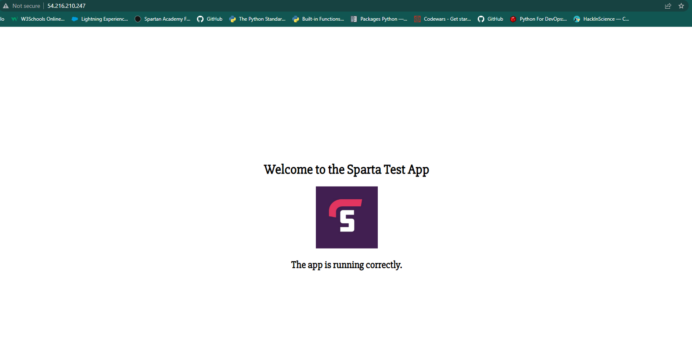

# VPC (Virtual Private Cloud)

VPC is a concept in cloud computing that enables users to create a private virtual network within a public cloud environment.

It provides users with greater control over their resources and an added layer of security.


### Main Benefits of VPC's

1. Greater control: VPC provide the users with more control over their network infrastructure, including the ability to define their own IP address range, create subnets, configure routing tables and manage security settings.

2. Enhnaced security: VPC's offer an added layer of security by isolating resources from the public internet and other resources in the cloud environment.

3. Cost saving: VPC's can help reduce costs by allowing users to allocate and manage resources more efficiently.

4. FLexibility: VPCs are highly customizable and can be configured to support a wide range of use cases, including hosting web applications, running databases, and deploying virtual machines.

5. Improved performance: VPCs can help improve performance by enabling users to deploy resources in the regions that are closest to their end-users or customers. This can help reduce latency and improve application performance.


## How does it benefit the business ?

1. Improved security: VPC provides a secure environment for applications and data.

2. Cost savings: VPC can reduce costs by enabling efficient resource allocation.

3. Flexibility: VPC is customizable and can support a range of use cases.

4. Scalability: VPC allows businesses to easily scale their infrastructure up or down based on demand.

5. Improved performance: VPC can improve application performance by deploying resources in regions closest to end-users or customers.

## Benefits of VPC in DevOps

1. Security and compliance: private network environment for more secure and compliant deployments

2. Scalability: easy to scale infrastructure up or down based on demand

3. Automation: can automate infrastructure provisioning, configuration management, and deployment

4. Isolation: allows for separate management and troubleshooting of 

5. Collaboration: provides a centralized and secure network environment for improved collaboration and productivity.


# Subnets


A subnet is a smaller network within a larger network. It allows for more efficient use of IP addresses and helps to organize network resources into smaller groups. A subnet can be used to separate network traffic, control network access, and improve network security.


## Private and Public subnets

**Private subnets**:

Private subnets are used for resources that should not be directly accessible from the public internet, while public subnets are used for resources that need to be accessible from the internet. Private subnets typically do not have a public IP address and use a network address translation (NAT) gateway to communicate with the internet.

**Public subnets**:

Public subnets have a public IP address and can communicate directly with the internet. Private subnets are often used to host databases, internal application servers, or backend services, while public subnets are used for web servers or load balancers that need to be accessible from the internet.


# CIDR blocks

(A Classless Inter-domain Routing) is a range of IP addresses that can be used to allocate IP addresses more efficiently.

CIDR blocks allow for the creation of subnets with varying numbers of IP addresses. 

**Example**:

 CIDR block of 10.0.0.0/16 includes all IP addresses from 10.0.0.0 to 10.0.255.255, with the first 16 bits representing the network portion of the IP address


 # Internet Gateway

 An Internet Gateway is a service provided by cloud computing providers, which allows resources within a private network such as Virtual Private Cloud(VPC), to access public internet.

 When an instance in a private subnet needs access to the internet, it sends its traffic  to the internet gateway, which then routes the traffic to its destination. 


 ## Route tables

 A route table is a set of rules that determines how traffic is routed between a private network (such as a VPC) and other networks, such as the internet. The route table contains a list of destination IP addresses and the target for each route. By managing the rules in the route table, network administrators can control how traffic flows in and out of the VPC and between subnets within the VPC.


 # Creating VPC, IG(Internet Gateway), Subnet, RT(Route Table), 

 


 First we need to navigate into the VPC section on AWS by using the search bar at the top of the page.

 We click on **"Create VPC"**. 

 

 In the picture above we can specify if we would like to create VPC only with our own configuration(VPC only).

 Use appropriate naming convention "marek-tech201-vpc".

 **"IPv4 CIDR"** in our case we choose "10.0.0.0/16". "Tenancy" we leave as default, and "Create VPC".


 Then we move onto **"Internet Gateway"** on the left of the page if creating VPC was succesful and **"Create Internet Gateway"**.


 Use appropriate naming convention "marek_devops_IG-tech201" and click on "Create Internet Gateway". So far this IG does not have access to the VPC we just created so we need to attach it to the VPC (Actions dropdown option).

 


 Select appropriate VPC(marek0tech-vpc) and click "Attach Internet Gateway". Next we need to allow internet access. To do that we go back to "Internet Gateway" section and find our IG. 

 To achieve that we need to create a **Subnet**

Navigate to the Subnet section on the left-hand side of the page and click on "Create Subnet".

Choose appropriate VPC(marek-tech201-vpc)


Choose appropriate name for the subnet("marek-tech201-public-SN")

- Availability Zones: No preference

- IPv4 CIDR block: 10.0.1.0/20 (These need to be unique to us, otherwise it wont allow to go further)

**"Create Subnet"**


Next we need to create **RT(Route Table)** for the guidance between these services.


Navigate onto the "Route Table" section on the left-hand side and "Create Route Table".

Use appropriate naming convention "marek-tech201-public-RT-access" and select the correct VPC and **"Create route table"**.


Next we need to make sure we configure correct Subnet associations and **"Edit subnet associations"**.


Select our subnet and Save it. 

Then we move onto **"Edit routes"** because there is no traffic and **"Add route"**.


- Destination: 0.0.0.0/0

- Internet gateway

**"Save changes"**


**NOTE**:

If we would like to launch a new instance with this VPC we need to set the configuration in the **Network settings**.


# Creating 2tier architecture VPC


First we need to deploy our APP instance and check the functionality.

Once we have the public subnet and route table for our app that would allow traffic from the internet, we will need to create a new security group.

**Create a new security group for the app instance**

- `Security group`
- `Create a security group`
- Use the appropriate naming convention
- Use the same name for the description
- Next we need to select our own VPC we created previously
**Rules**:
- Allow port 22(My IP), port 80(Anywhere), and port 3000(Anywhere)
- Enable "Auto-assing public IP"


Next we need to create new EC2 instance from our app AMI(Amazon Machine Image)

- `EC2 Dashboard`
- `Launch Instance`
- Appropriate naming convention
- Select the desired AMI
- Select the appropriate key pair

**Network settings**

- `Edit`
- Select your own VPC
- Select the public subnet we created previously
- Select Security group that we just created
- Lastly `Create instance`

After the instance has been launched we can check the functionality by entering the Public IPv4 IP address into our browser.




## **Now we can move onto the private subnet with DB instance.**

We need to create a private subnet.

We follow the same steps as before: `Subnets`-`Create subnet`-`Choose your VPC`- `Appropriate naming convention`

With the IPv4 CIDr block we need to make sure we use the one that is available and is not in use. 

`Create Subnet`


**Creating a Route Table**

`VPC dashboard`- `Route tables`- `Create route table`
Select your own VPC from the list.
Lastly, we click on `Create route table`

Inside the Route table window, we need to configure a few things.

**Subnet association**: `Edit subnet association`= Private subnet we just created

**Routes**: This route should only communicate with our app instance, not being internet-facing. It should only allow local access.

We will need to create a new security group.

- `VPC Dashboard`
- `Security groups`
- `Create security group`
- Name and description should be the same and unique
- Select your VPC from the list

**Inbound rules**: 

- Allow port 22(My IP)
- Port 27017(Anywhere)

`Create security group`


**Now we can create an EC2 instance from our DB AMI**

Important thing is to **Disable** the Auto-assing public IP.


Once we have launched both instances, we will have to connect to our app instance using GitBash terminal to establish a connection between these 2 instances.
We can achieve this by creating an **Environment variable** with the private IP from the DB and the port(27017).

```
export DB_HOST=mongodb://private_IP_of_DB:27017/posts

printenv DB_HOST # This commands prints out the variable if it has been succesfully created

cd app

npm install

node seeds/seed.js # This command populates our app with data

node app.js # To run the app

```

### **Note**

If you encounter an error specifying that the port 3000 is in use already, this means that when we launched the app instance from our AMI there was certain configuration in place already. In our user data section we used script `nohup` that would run our app in the background as soon as it launches.

To resolve this we will need to kill that process first using  `sudo lsof -i :3000`. This command shows us the processes that use the 3000 port.

To kill the process we use `sudo kill -9 PID of the process that is using the port 3000`

Once we have done that we can run the following commands again:

- `npm install`
- `node seeds/seed.js`
- `node app.js`

If the app is ready and listening on port 3000, we can check the functionality in the browser by copying the public IP of our app instance and pasting it into the browser search bar. 


