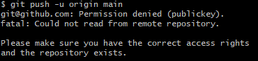

# SSH key pair and HTTP

Step 1.:

- Create an SSH RSA key
- Open GitBash terminal
- Navigate into the `.ssh` folder where we store our keys
- `ssh-keygen -t rsa -b 4096 -C "email_address"`
- Next we name our key 
- "passphrase" press Enter
- Press Enter again
- Now we have generated 2 files(name-key, name-key.pub) one being the padlock- public key, and the other private key
The padlock is being public that needs to be linked with GitHub.
The actual key is private, it is unique and not accessible to anyone else but us.

**NOTE**: Public key can be generated from the private key, but private key can not be generated from the public key

RSA keys-  Complex mathematical algorithm

Step 2.:

We need to add the public key to our GitHub in Settings->SSH and GPG keys-> Register new ssh key

We also have to name it the similar way as the key that we created previously(name.pub).

Next we need to establish the link between these. In our GitBash terminal we use `cat name.pub` to display the content of the key file.

Copy and paste that content carefully the whole content and click on `Generate ssh key`.

Step 3.:

Now we need to register the keys.

- eval `ssh-agent -s` (``)
- `ssh-add github-key`

If we wish to check if it has been succesful we can use `ssh -T git@github.com` and confirm with `yes`. 

Step 4.:

Now we need to create a new repository on GitHub.

- Create a new repo called "test-ssh"
- Click on the Green button where we have options for "SSH" and "HTTPS" and click on "SSH"
- In the GitBash terminal we navigate into the folder where we have all repos stored locally
- `mkdir test-ssh` to create a directory
- Create a README.me in that directory
- Add any changes to that file using `nano README.md`
- To display changes use `cat README.md`

Step 5.:

Now we can push all the changes made using SSH.

- `git init`- this creates(initializes) a hidden folder that stores all the commits and stages for commiting.
- ` git add .` to add all the changes made
- `git status` to see if those changes are ready for commiting
- `git commit -m "message"`
- `git branch -M main`- specifies the branch that we want to push the changes to.

- `git remote add origin + "The SSH path from GitHub repo"` - Specifies the SSH version of the repo want to push to

- `git push -u origin main` - Pushes the changes to the branch we chose

**NOTE**: 

If we are unable to push the changes and recieve this error:

This could mean that we have used two GitBash terminals and they do not have the same configuration. To resolve that you could use the initial terminal, navigate to the directory with your README.md and attempt to push the changes from there. 

### HTTPS

If we would like to switch between SSH to HTTPS:

If we try to `git remote add origin + HTTP_URL_from_repo` we would get a message "error: remote origin already exists"

If we need a guidance we can use the Git remote manual page- `git remote --help`

In this case we need to use `git remote remove origin`

Next we can use the command that we needed previously `git remote add origin + HTTP_URL_from_repo` and we are adding the origin with HTTPS.

We can make another change to our README.md file to test the functionality.

- `nano README.me`

Next we need to stage the changes `git add .`

- `git commit -m "message"`

- `git push -u origin main`

We can now refresh the page on GitHub to see the changes we just made using HTTPS.

Once we push changes the first time we can use `git push` because  from this point onward the HTTPS will use the main branch as the default. 